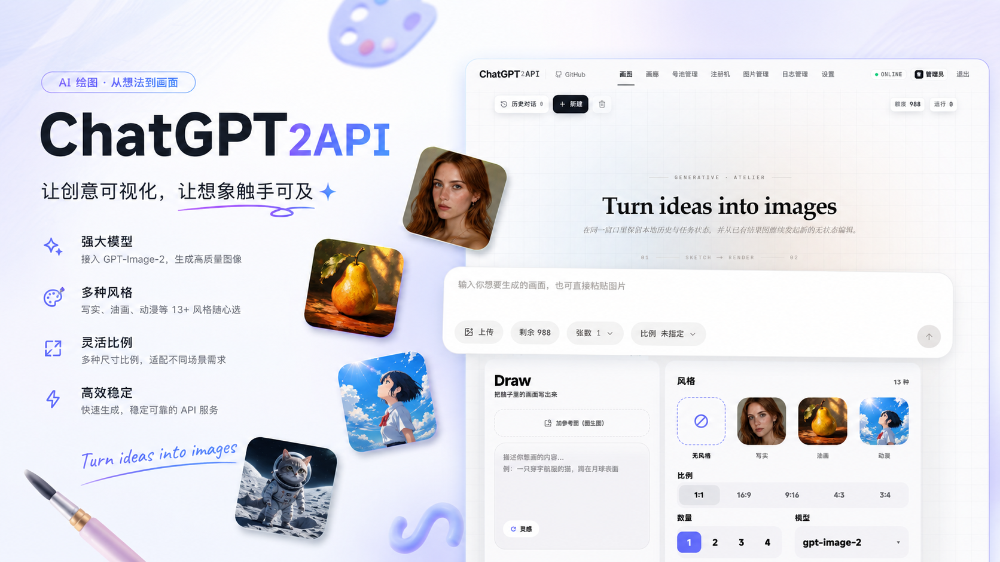
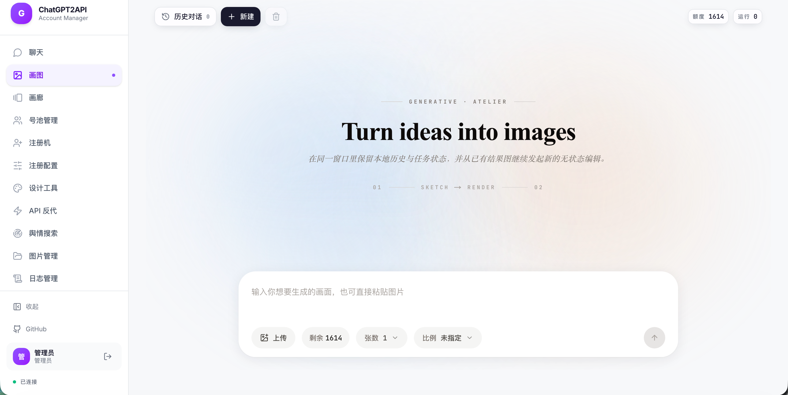
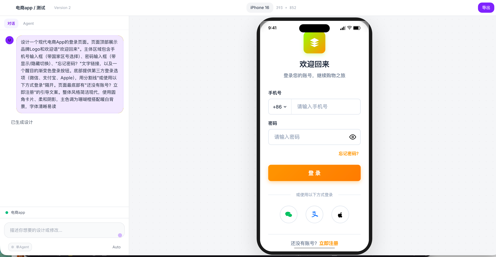
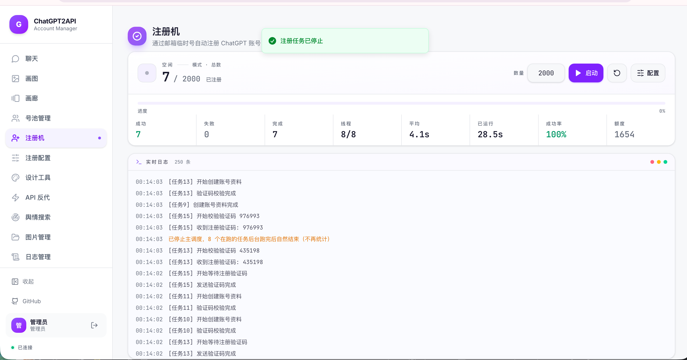
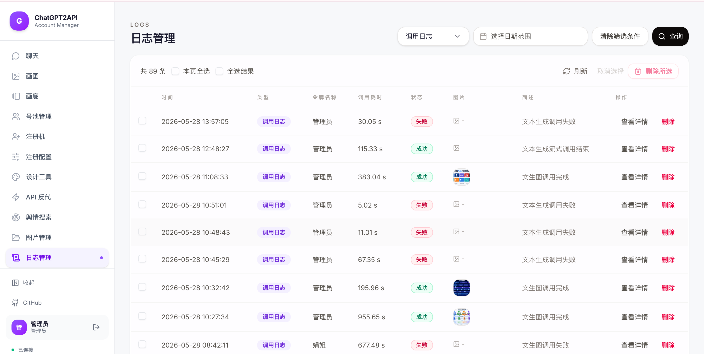
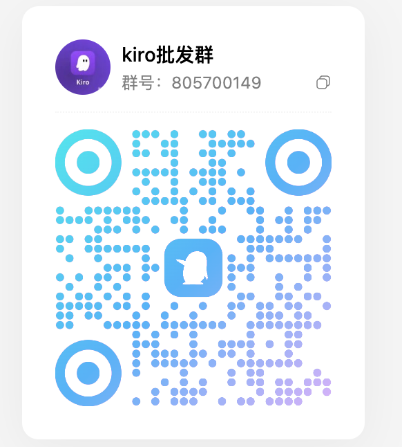

<h1 align="center">
  
  <br />
  ChatGPT2API
</h1>

<p align="center">
  对 ChatGPT 官网图片生成 / 编辑能力的逆向封装。<br />
  提供 OpenAI 兼容 API、在线画图工作台、设计工具、号池管理、邮箱注册流水线。<br />
  开箱即用，Docker 一键部署。
</p>

<p align="center">
  
</p>

<p align="center">
  <a href="https://github.com/boteSu/aiChatGptAgent/releases">Releases</a> ·
  <a href="#api">API 参考</a> ·
  <a href="#交流群">交流群</a>
</p>

---

> [!WARNING]
> **免责声明**：本项目仅供个人学习与非商业性技术交流。严禁用于商业用途、批量滥用、套利倒卖、违法内容生成等。使用者自行承担全部风险（账号封禁、法律责任等），继续使用即视为同意。

> [!IMPORTANT]
> **请勿使用重要 / 高价值账号**，存在受限或封禁风险。

## 功能概览

| 模块 | 能力 |
|---|---|
| **OpenAI 兼容 API** | `/v1/images/generations`、`/v1/images/edits`、`/v1/chat/completions`、`/v1/responses`、`/v1/messages`、`/v1/models` |
| **在线画图工作台** | 文生图、图片编辑、多图组图、参考图上传、会话历史、图片缓存 |
| **设计工具** | AI 辅助 UI/UX 设计、页面生成、组件设计 |
| **号池管理** | 自动刷新额度、剔除失效 Token、限流检查、轮询调度、批量导入 |
| **注册机** | ChatGPT 邮箱注册流水线，SSE 实时进度 |
| **日志 & 图片管理** | 按级别/时间筛选日志，图片浏览/标签/检索/清理 |
| **中转 API** | 接入第三方 OpenAI 兼容 API（支持 Claude / Gemini / DeepSeek 等模型透传） |

## 快速开始

```bash
git clone https://github.com/boteSu/aiChatGptAgent.git
cd aiChatGptAgent
cp config.example.json config.json   # 编辑 auth-key
docker compose up -d
```

打开 `http://localhost:3001`，完事。

| 常用命令 | 作用 |
|---|---|
| `docker compose logs -f` | 查看日志 |
| `docker compose restart` | 重启 |
| `docker compose pull && docker compose up -d` | 升级到最新版 |

> 支持 `linux/amd64` 与 `linux/arm64`。

<details>
<summary><b>从源码构建（开发者）</b></summary>

```bash
# 构建前端
cd web && npm install && npm run build && cd ..
rm -rf web_dist && cp -r web/out web_dist

# 启动
docker compose -f docker-compose.local.yml up -d --build
```

修改后端：`docker restart chatgpt2api-local`

修改前端：重新构建 → 替换 web_dist → restart。

</details>

## 配置

编辑 `config.json` 或在 Web 设置页修改，重启生效。

| 字段 | 说明 |
|---|---|
| `auth-key` | 全局管理员密钥 |
| `proxy` | 全局代理（http/socks5） |
| `base_url` | 公网 URL，用于生成图片直链 |
| `image_retention_days` | 图片缓存保留天数 |
| `account_route_strategy` | 号池调度策略 |
| `auto_remove_invalid_accounts` | 自动剔除失效账号 |
| `backup` | Cloudflare R2 自动备份 |

<details>
<summary><b>环境变量</b></summary>

| 变量 | 说明 |
|---|---|
| `CHATGPT2API_AUTH_KEY` | 覆盖 config 的 auth-key |
| `CHATGPT2API_BASE_URL` | 公网 URL |
| `STORAGE_BACKEND` | `json` / `sqlite` / `postgres` / `git` |
| `DATABASE_URL` | 数据库连接串 |

</details>

<details>
<summary><b>存储后端</b></summary>

| 类型 | 适用场景 |
|---|---|
| `json` | 默认，零配置，单机 |
| `sqlite` | 本地数据库，中小规模 |
| `postgres` | 多节点共享（支持 Supabase） |
| `git` | 私有仓库，天然版本化 |

</details>

## API

所有接口需要请求头 `Authorization: Bearer <auth-key>`。

<details>
<summary><code>GET /v1/models</code></summary>

```bash
curl http://localhost:3001/v1/models -H "Authorization: Bearer <auth-key>"
```

</details>

<details>
<summary><code>POST /v1/images/generations</code> · 文生图</summary>

```bash
curl http://localhost:3001/v1/images/generations \
  -H "Content-Type: application/json" \
  -H "Authorization: Bearer <auth-key>" \
  -d '{"model":"gpt-image-2","prompt":"一只漂浮在太空里的猫","n":1}'
```

</details>

<details>
<summary><code>POST /v1/images/edits</code> · 图片编辑</summary>

```bash
curl http://localhost:3001/v1/images/edits \
  -H "Authorization: Bearer <auth-key>" \
  -F "model=gpt-image-2" \
  -F "prompt=改成赛博朋克风格" \
  -F "image=@./input.png"
```

</details>

<details>
<summary><code>POST /v1/chat/completions</code> · Chat（图片/文本）</summary>

```bash
curl http://localhost:3001/v1/chat/completions \
  -H "Content-Type: application/json" \
  -H "Authorization: Bearer <auth-key>" \
  -d '{"model":"gpt-image-2","messages":[{"role":"user","content":"画一只猫"}]}'
```

模型名以 `claude` / `gemini` / `deepseek` 开头时自动走中转 API。

</details>

<details>
<summary><code>POST /v1/messages</code> · Anthropic 兼容</summary>

```bash
curl http://localhost:3001/v1/messages \
  -H "x-api-key: <auth-key>" \
  -H "anthropic-version: 2023-06-01" \
  -H "Content-Type: application/json" \
  -d '{"model":"claude-sonnet-4-20250514","messages":[{"role":"user","content":"hi"}]}'
```

</details>

## 截图

号池管理：


在线画图：



设计工具：



注册机：



日志管理：



图片管理：


## 交流群

有问题先看 README 与 [Issue](https://github.com/boteSu/aiChatGptAgent/issues)，确实搞不定可以加群交流。

> [!WARNING]
> 请勿在群内传播账号、密钥等敏感信息。

<p align="center">
  
  <br />
  QQ 群号：805700149
</p>

## 赞赏支持

如果这个项目对你有帮助，欢迎请作者喝杯咖啡 ☕ 谢谢大家的支持！

<p align="center">
  
</p>

## License

[MIT](LICENSE)
