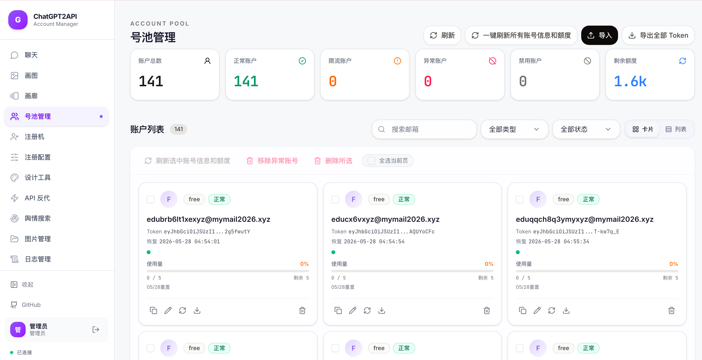

<h1 align="center">ChatGPT2API</h1>

<p align="center">
  把 ChatGPT 官网的画图能力变成标准 API，Docker 一键跑起来。
</p>

<p align="center">
  
</p>

---

## 它能干什么

- 🎨 **画图 API** — 兼容 OpenAI `/v1/images/generations` 和 `/v1/images/edits`，对接 Cherry Studio、New API 等客户端直接用
- 💬 **聊天 API** — `/v1/chat/completions`、`/v1/messages`，支持中转 Claude / Gemini / DeepSeek
- 🖌️ **在线画图工作台** — 网页上直接画，支持文生图、图生图、多图编辑
- 🎯 **设计工具** — AI 辅助 UI 设计
- 📦 **号池管理** — 批量导入账号，自动轮询、自动剔除失效的
- 🤖 **注册机** — 自动注册 ChatGPT 账号，产出完整凭证（含 `refresh_token`）
- 🔀 **反向代理** — 号池账号封装为标准 OpenAI API，支持多用户分发、Key 管理、自动轮询调度
- 📊 **日志 & 图片管理** — 全部可视化

## 注册机产出格式

注册成功的每个账号都会生成完整凭证，支持一键导出 / 复制：

```json
{
  "id_token": "eyJ...",
  "access_token": "eyJ...",
  "refresh_token": "rt_xxxxxxxx...",
  "account_id": "b6aa9755-xxxx-xxxx-xxxx-xxxxxxxxxxxx",
  "last_refresh": "2026-05-26T13:10:11.000Z",
  "email": "xxx@outlook.com",
  "type": "codex",
  "expired": "2026-06-04T13:54:51.000Z"
}
```

> **带 `refresh_token`**，可直接用于 CPA / sub2api / 其他号池管理工具导入，支持 token 自动续期。

## 中转站接入

项目部署后就是一个完整的 **OpenAI 兼容 API 中转站**，号池在内部自动轮询，对外暴露标准接口，任何支持 OpenAI 协议的客户端都能直接接：

```
你的号池账号 → ChatGPT2API（中转站）→ 标准 OpenAI API → 客户端 / 用户
```

**核心能力：**
- 对外暴露标准 OpenAI API（`/v1/chat/completions`、`/v1/images/generations` 等）
- 号池内部自动轮询调度、失效剔除，对用户透明
- 支持生成多个客户端 Key，每个 Key 独立管理
- 支持多用户分发 + 额度控制
- Web 面板内置接入指南，一键复制 Base URL / Key / curl 示例

### 接入教程

**第 1 步：拿到接入信息**

打开 Web 面板 → 设置 → 接入指南，复制三样东西：

| 配置项 | 说明 | 示例 |
|---|---|---|
| Base URL | 你的部署地址 + `/v1` | `http://你的IP:3001/v1` |
| API Key | `config.json` 里的 `auth-key`，或 Web 面板生成的 user key | `sk-xxxx` |
| 模型名 | 见下方模型表 | `auto` / `gpt-image-2` |

**第 2 步：命令行验证一下**

```bash
curl http://你的IP:3001/v1/chat/completions \
  -H "Authorization: Bearer 你的auth-key" \
  -H "Content-Type: application/json" \
  -d '{"model":"auto","messages":[{"role":"user","content":"你好"}]}'
```

收到 JSON 回复说明中转站正常工作，可以接客户端了。

**第 3 步：客户端接入**

任何支持自定义 OpenAI API 的客户端都能用，填 Base URL + API Key 即可：

- **Cherry Studio** — 设置 → 模型服务 → 添加 → OpenAI 兼容 → 填 Base URL + Key
- **ChatBox** — 设置 → AI 提供方 → OpenAI API Compatible
- **NextChat / LobeChat** — 设置 → API Key + Endpoint
- **OpenCat / Raycast AI** — 自定义 API 地址
- **沉浸式翻译 / 划词翻译** — 翻译服务选 OpenAI → 填 Base URL + Key
- **New API / One API** — 添加渠道 → 类型选 OpenAI → 填代理地址 + Key（再分发给下游）

**第 4 步：多用户分发（可选）**

想把 API 分给多个人用、每人单独限额：

1. Web 面板 → 设置 → 用户管理 → 新建 user key
2. 设置该 key 的额度、可用模型
3. 把 user key 发给对方，对方用这个 key 代替 `auth-key` 即可

**代码接入示例（Python）：**

```python
from openai import OpenAI

client = OpenAI(
    base_url="http://你的IP:3001/v1",
    api_key="你的auth-key",
)

# 聊天
chat = client.chat.completions.create(
    model="auto",
    messages=[{"role": "user", "content": "你好"}],
)
print(chat.choices[0].message.content)

# 画图
img = client.images.generate(model="gpt-image-2", prompt="一只太空猫", n=1)
print(img.data[0].url)
```

## 三步部署

```bash
git clone https://github.com/boteSu/aiChatGptAgent.git
cd aiChatGptAgent
cp config.example.json config.json   # ← 打开改一下 auth-key
docker compose up -d
```

打开 **http://localhost:3001** 就能用了。

升级：`docker compose pull && docker compose up -d`

## 可用模型

| 模型名 | 用途 | 说明 |
|---|---|---|
| `gpt-image-2` | 画图 | 默认画图模型 |
| `codex-gpt-image-2` | 画图（Codex 通道） | 需 Plus/Team/Pro 账号 |
| `auto` | 文本聊天 | 自动选号池里最好的模型 |
| `gpt-5` / `gpt-5-mini` | 文本聊天 | 指定模型 |
| `claude-*` / `gemini-*` / `deepseek-*` | 中转文本 | 走中转 API，需在设置页配置 |

## API 速查

```
GET  /v1/models              → 可用模型列表
POST /v1/images/generations  → 文生图
POST /v1/images/edits        → 图生图（上传参考图）
POST /v1/chat/completions    → 聊天（文本/画图都走这里）
POST /v1/messages            → Anthropic 兼容格式
POST /v1/responses           → Responses API
```

所有请求加 Header：`Authorization: Bearer <你的key>`

## 配置说明

编辑 `config.json` 或在 Web 设置页改，改完 `docker compose restart` 生效。

| 字段 | 干什么的 |
|---|---|
| `auth-key` | 你的管理员密码，访问 API 和网页都靠它 |
| `proxy` | 代理地址（http/socks5），没梯子填这个 |
| `base_url` | 公网域名，用于生成图片直链 |
| `auto_remove_invalid_accounts` | 失效账号自动踢掉 |

更多配置看 Web 面板的设置页，都有中文说明。

## 账号导入

号池页面支持 4 种方式：

1. **本地文件** — 上传 CPA 格式的 JSON
2. **远程 CPA 服务器** — 填地址自动拉取
3. **sub2api** — 填 sub2api 服务器地址
4. **直接粘贴** — 粘 access_token 就行

## 注册机

自动注册 ChatGPT 账号，注册成功后自动入号池。

### 你需要准备什么

| 必须 | 说明 |
|---|---|
| **代理** | 海外 IP，支持 HTTP / SOCKS5。建议用住宅代理或代理池（711Proxy 等），数据中心 IP 容易被拦 |
| **临时邮箱服务** | 用来接收 OpenAI 的验证码。支持多种后端（见下面列表） |

| 可选 | 说明 |
|---|---|
| **SMS 接码平台** | 部分账号注册时会要求手机验证，需要接码服务才能过。没配置的话遇到手机验证会直接失败跳过 |
| **CPA 导出** | 注册成功后自动把账号推到远程 CPA 服务器 |

### 支持的邮箱后端

| Provider | 需要什么 |
|---|---|
| **Cloudflare Temp Email** | 自建实例的 API 地址 + admin 密码 + 域名 |
| **TempMail.lol** | API Key（付费），可选自定义域名 |
| **DuckMail** | API Key + 域名 |
| **GPTMail** | API Key，可选域名 |
| **MoEmail** | 自建实例的 API 地址 + API Key + 域名 |
| **Inbucket** | 自建实例的 API 地址 + 域名 |
| **YYDS Mail** | API Key + 域名 |

### 搭建 Cloudflare Temp Email（推荐）

项目地址：[dreamhunter2333/cloudflare_temp_email](https://github.com/dreamhunter2333/cloudflare_temp_email)
部署文档：[temp-mail-docs.awsl.uk](https://temp-mail-docs.awsl.uk/)

**你需要：**
- 一个 Cloudflare 账号（免费）
- 一个域名（托管到 Cloudflare）

**部署步骤：**

1. Fork [cloudflare_temp_email](https://github.com/dreamhunter2333/cloudflare_temp_email) 到你自己的 GitHub
2. 在 Cloudflare Dashboard 创建一个 **D1 数据库**（名字随意，比如 `temp-email`）
3. 在 Cloudflare Dashboard → Email Routing 开启邮件路由，把你的域名指向 Worker
4. 通过 GitHub Actions 一键部署（仓库里有现成的 workflow），或者用 `wrangler` CLI 手动部署
5. 部署完成后你会得到一个地址（比如 `https://mail.你的域名.com`）
6. 进入后台设置 **admin 密码**

**在注册机里怎么配：**

| 配置项 | 填什么 |
|---|---|
| API 地址 | `https://mail.你的域名.com`（你部署的实例地址） |
| Admin 密码 | 你在后台设的管理员密码 |
| 域名 | 你绑定到 Cloudflare Email Routing 的域名，比如 `example.com` |

> [!TIP]
> 支持配置多个域名轮换使用，某个域名被 OpenAI 拉黑后切换下一个。
> 还支持通配符域名（`*.example.com`），每次注册自动生成随机子域名，降低被封风险。

### 代理池配置

支持两种模式：

**模式 A：用户名/密码（推荐）** — 每次注册自动换 session ID 实现不同 IP

```json
{
  "enabled": true,
  "mode": "userpass",
  "host": "proxy.example.com",
  "port": 1000,
  "username": "your_username",
  "password": "your_password",
  "protocol": "http"
}
```

**模式 B：API 提取** — 调代理商接口批量拉 IP，轮询使用

```json
{
  "enabled": true,
  "mode": "api",
  "api_url": "https://你的代理商提取链接",
  "api_protocol": "http",
  "api_refresh_seconds": 300
}
```

### 怎么启动

1. 打开 Web 面板 → 侧边栏「注册机」
2. 配置邮箱后端（填 API 地址、Key、域名）
3. 配置代理（单代理或代理池）
4. 设置注册模式：
   - **按数量** — 注册 N 个就停
   - **按额度** — 号池总额度达到目标就停
   - **按可用数** — 号池正常账号达到目标就停
5. 点「启动」，实时看日志

### 注意事项

- 邮箱域名被 OpenAI 封了会注册失败，换域名就行
- 代理 IP 质量直接决定成功率，住宅代理 > 数据中心
- 并发线程数别开太高（3-5 够了），容易触发风控
- 注册成功的账号自动进号池，不需要手动导入

## 截图

号池管理：



在线画图：


设计工具：


注册机：


日志管理：


图片管理：


## 交流 & 赞赏

<p align="center">
  
  &nbsp;&nbsp;&nbsp;&nbsp;&nbsp;
  
  <br />
  QQ 群：805700149 &nbsp;&nbsp;|&nbsp;&nbsp; 微信赞赏
</p>

> [!WARNING]
> 请勿在群内传播账号、密钥等敏感信息。

## License

[MIT](LICENSE) — 仅供学习与技术交流，风险自负。
